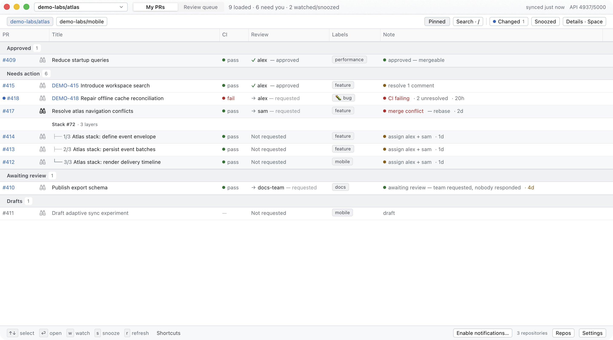
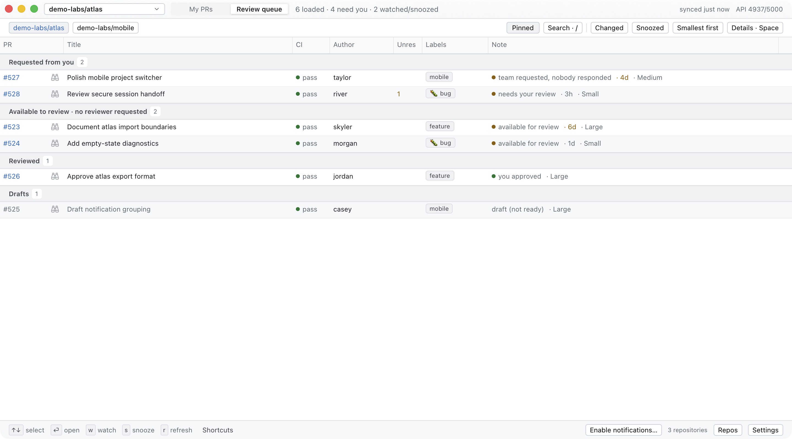
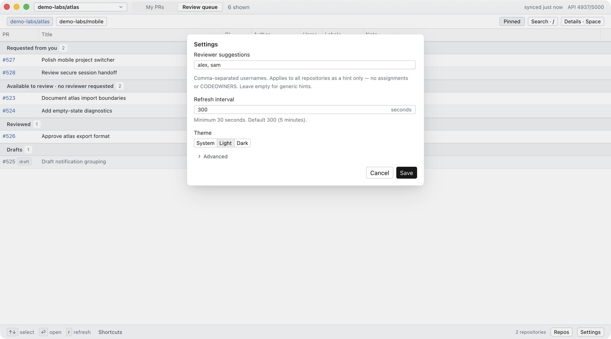
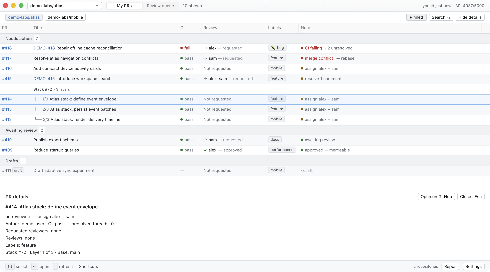

<picture>
  <source media="(prefers-color-scheme: dark)" srcset="assets/branding/logo-dark.svg">
  <source media="(prefers-color-scheme: light)" srcset="assets/branding/logo-light.svg">
  
</picture>

# PR Marmot

**A native desktop dashboard for deciding what to do next on GitHub pull
requests.** PR Marmot turns CI, review requests, completed reviews, unresolved
threads, conflicts, labels, linked issues, and GitHub stacks into two focused
queues with a plain-language **Note** on every row.

- **Involving me** is the zero-config, all-repositories default. Your own PRs
  keep actionable Notes; other authors' PRs use ownership-aware status Notes.
  Selecting one repository changes this queue to **My PRs** with the existing
  authored behavior.
- **Review queue** separates PRs that request your review from PRs with no
  reviewer requested that are available for someone to pick up.
- **Read-only by design:** PR Marmot can open a PR or linked issue and copy its
  URL, but it never assigns reviewers, comments, merges, or changes GitHub.
- **Uses your existing GitHub CLI login:** API access goes through an
  authenticated [`gh`](https://cli.github.com) installation.



*My PRs. All repositories, people, pull requests, labels, and statuses shown in
the screenshot are fictional.*



*Review queue. The screenshot uses entirely fictional data. “Requested” means
your user was explicitly requested. “Available to review” means the PR has no
pending user or team review request; it is an optional pool, not an assignment.*

Native GitHub stacks are grouped and ordered by layer, so dependent PRs can be
reviewed from the base upward. A label such as `backend`, `security`, or
`frontend` supplies context at scan speed. Together, stack order and labels make
the available pool useful when choosing work that matches your area without
pretending GitHub assigned it to you.

## Install

### Requirements

None beyond the app itself. PR Marmot checks for a GitHub sign-in after its
window opens; if it finds none, the sign-in screen offers **Sign in with
GitHub** (a one-time code you type at github.com), **Use a token**, and
**Enterprise host**. See [Signing in](#signing-in).

If you already use the [GitHub CLI](https://cli.github.com), PR Marmot picks up
its session instead and you can skip signing in:

```sh
gh auth login
```

Prebuilt releases are signed and notarized for **Apple-silicon macOS**. Linux
and Intel Mac users build from source for now.

### Apple-silicon macOS

Run the installer from inside a GitHub checkout so it can detect that
repository, or pass the initial repository explicitly:

```sh
# Detect the repository from the current checkout
curl -fsSL https://raw.githubusercontent.com/oliver-kriska/prmarmot/main/install.sh | sh

# Or configure a repository explicitly (recommended for scripted installs)
curl -fsSL https://raw.githubusercontent.com/oliver-kriska/prmarmot/main/install.sh \
  | sh -s -- --repo owner/name
```

The installer downloads the latest macOS arm64 release, installs
`/Applications/prmarmot.app` (`~/Applications` for accounts that cannot write
`/Applications`; `--dir <dir>` to choose), verifies the published checksum,
Developer ID signature, notarization ticket, and Gatekeeper acceptance, and
creates the config file only when it can resolve an accessible repository. It never
overwrites an existing config. It also links the bundled
[terminal and agent CLI](#terminal-and-agent-cli) as `~/.local/bin/prmarmot-cli`
(`--bin-dir <dir>` to choose another directory, `--bin-dir ""` to skip).

Or install the same signed artifact with Homebrew:

```sh
brew install --cask oliver-kriska/tap/prmarmot
```

The cask links `prmarmot-cli` into Homebrew's `bin` as well.

Every install path — the installer, Homebrew, and `make install` — uses the same
`/Applications/prmarmot.app`, so a Mac has one PR Marmot. The installer and
`make install` remove an older copy that earlier versions put in
`~/Applications`. Once Homebrew manages the app, update with
`brew upgrade --cask prmarmot`; the installer refuses and says so. If an app is
already in `/Applications` when you first install the cask, use
`brew install --cask --force oliver-kriska/tap/prmarmot` to replace it.

**Updating? Quit the installed app before running the installer again.**

The former app was named `prboard`. PR Marmot uses new app, binary, config, and
state names. Keep the old installation and data until the first PR Marmot
launch confirms the app's one-time storage migration; see
[`packaging/RELEASING.md`](packaging/RELEASING.md).

### Build from source

Requires Git, latest stable Rust (dependency minimum 1.92, not tested), and the
platform dependencies required by GPUI. macOS additionally needs full Xcode and its Metal Toolchain. Linux
needs a working Vulkan stack plus fontconfig, xkbcommon, and the normal X11 or
Wayland development/runtime libraries.

```sh
curl -fsSL https://raw.githubusercontent.com/oliver-kriska/prmarmot/main/install.sh \
  | sh -s -- --from-source --repo owner/name
```

On macOS this installs `/Applications/prmarmot.app`, the same app the cask
manages, and links `~/.local/bin/prmarmot-cli` into it (`make install` from a
checkout does the same, replacing a Homebrew-installed app until the next
`brew upgrade`); on Linux it installs the `prmarmot` and `prmarmot-cli` binaries to
`~/.local/bin` by default. There are no prebuilt Linux packages yet.

## First run

1. Launch **PR Marmot** from Spotlight/Finder on macOS, or run `prmarmot` on Linux.
2. If prompted, sign in on the screen that appears (see
   [Signing in](#signing-in)), or complete `gh auth login` in Terminal and click
   **Retry**. Your token is never displayed.
3. The default **All repositories** scope shows open PRs involving your resolved
   GitHub login. Pick a specific repository for its complete scoped result.
4. Switch between **Involving me** (or **My PRs** in one repo) and **Review
   queue** in the title bar.

Click **Settings** in the bottom-right corner to edit reviewer suggestions,
the refresh interval, and the theme directly—no file editing required.
Expand **Advanced** to configure issue links or copy the config-file path.
**Save** validates and applies changes without restarting; **Cancel** discards
your edits. Reviewer and issue-link changes reload the board, subject to the
GitHub rate-limit budget. Theme changes apply immediately on Save. Validation
errors appear beside the relevant fields and focus the first invalid input
(opening and scrolling Advanced when needed); a brief footer message confirms a
successful save.



*Settings shown with fictional reviewer names. Environment-controlled fields
are disabled and labeled; saving other settings leaves their file values alone.*

## Signing in

PR Marmot reads GitHub with your own token and nothing else: there is no PR
Marmot account, no server of ours in the path, and the token never leaves the
machine it was stored on.

Three ways in, in the order the sign-in screen offers them:

- **Sign in with GitHub** — GitHub's OAuth *device flow*. The app shows an
  eight-character code, you open `https://github.com/login/device` and type it,
  and the app continues on its own. There is no client secret and no callback
  URL, which is why it works with no server. The access token is refreshed
  automatically; roughly every six months the refresh token expires and you sign
  in again.
- **Use a token** — paste a personal access token. A *fine-grained* token needs
  **Pull requests: read** and **Metadata: read** and covers one owner; a
  *classic* token with `repo` covers several organizations at once.
- **Enterprise host** — a GitHub Enterprise Server hostname. GHES supports the
  device flow, but each instance is a separate app registration, so set
  `client_id` for it (below) or sign in with a token.

The same three paths exist in the terminal:

```sh
prmarmot-cli auth login                     # device flow
gh auth token | prmarmot-cli auth login --with-token
prmarmot-cli auth login --host ghe.example.com
prmarmot-cli auth status
prmarmot-cli auth logout
```

**Where the token is kept.** macOS: the login keychain, service
`dev.prmarmot.auth`. Linux: `$XDG_STATE_HOME/prmarmot/auth.json`, mode `0600`.
Set `[auth] store = "file"` to use the file on macOS too — worth doing if the
keychain prompts you once per binary, which it does because keychain access
control is per-application.

**Disconnecting.** Settings → **Disconnect**, or `prmarmot-cli auth logout`,
removes the token from this machine. Revoking PR Marmot's access at GitHub is a
separate step you take at `https://github.com/settings/applications`: doing it
from the app would need a client secret, and PR Marmot has none by design.

**Environment overrides**, highest precedence first: `--host` / `--auth` flags
(CLI), then `PRMARMOT_HOST`, `GH_HOST`, `PRMARMOT_AUTH`, `PRMARMOT_CLIENT_ID`,
`PRMARMOT_TOKEN`, then the `[auth]` block in the config file.
`PRMARMOT_AUTH` takes `auto` (a stored token, else the GitHub CLI — the
default), `gh`, `device`, or `token`. `PRMARMOT_TOKEN` supplies a token for one
run and is never written to the store, which makes it the right switch for CI:

```sh
PRMARMOT_AUTH=token PRMARMOT_TOKEN=$GITHUB_TOKEN prmarmot-cli mine --json
```

## Configuration

The config file is:

- `$XDG_CONFIG_HOME/prmarmot/config.toml` when `XDG_CONFIG_HOME` is an absolute
  path;
- otherwise `~/.config/prmarmot/config.toml`.

Every setting is optional. With no scope or repository, the app opens all
repositories:

```toml
scope = "all"                            # all | repo; clean default is all
repo = "acme/widgets"                    # remembered specific repository
repos = ["acme/widgets", "acme/api"]    # extra repo-picker entries
pinned_repos = ["acme/widgets"]          # toolbar shortcuts, maximum 12
refresh_secs = 300                       # default 300; hard floor 30
theme = "system"                         # system | light | dark
view = "authored"                        # authored | review
notifications = true                    # transition alerts while app runs
notification_sound = true
notify_all_needs_action = false         # watched PRs still notify
dock_badge = true                       # macOS; no-op on Linux
automatic_update_checks = true          # latest stable release, at most daily
stale_after_days = 3                    # waiting this long for a reviewer is stale

# Suggestions used only in the authored-PR “no reviewers” note.
default_reviewers = ["alice", "bob"]     # any repository without an entry below

[repo_reviewers]
"acme" = ["carol", "dave"]               # every repository owned by acme
"acme/api" = ["erin"]                    # this repository (wins over "acme")
"acme/sandbox" = []                      # suggest nobody here

[issue_link]
pattern = "PROJ-[0-9]+"                  # regex matched in PR titles
url_template = "https://linear.app/acme/issue/{id}"

[window]
width = 1440
height = 860

[auth]
host = "github.com"                      # or a GitHub Enterprise Server host
client_id = "Iv1.xxxxxxxxxxxx"           # OAuth client ID; public by design
mode = "auto"                            # auto | gh | device | token
store = "auto"                           # auto (keychain on macOS) | keychain | file
```

### What `default_reviewers` does—and does not do

`default_reviewers` and `[repo_reviewers]` are static hints. When one of
**your** non-draft PRs has no pending reviewer request and no qualifying
completed review, its Note can say, for example, “assign alice + bob.” PR Marmot
picks the list for the PR's repository (`"owner/name"`), else for its owner
(`"owner"`), else `default_reviewers`; keys are case-insensitive, and an empty
list suggests nobody. It does **not** assign those people, validate that they
are suitable for the repository, read or implement `CODEOWNERS`, or infer GitHub
ownership. Settings edits `default_reviewers`; edit `[repo_reviewers]` in the
file. `PRMARMOT_DEFAULT_REVIEWERS` replaces only `default_reviewers`.

Issue links are optional and tracker-agnostic. `{id}` in `url_template` is
replaced with the first identifier matched by `pattern`; no tracker or project
prefix is built in.

CLI options override environment variables, which override the config file:

- `PRMARMOT_REPO`
- `PRMARMOT_SCOPE` (`all` or `repo`)
- `PRMARMOT_REFRESH_SECS`
- `PRMARMOT_THEME`
- `PRMARMOT_DEFAULT_REVIEWERS` (comma-separated)
- `PRMARMOT_ISSUE_PATTERN` and `PRMARMOT_ISSUE_URL_TEMPLATE` (use together)

Use `--all-repos` or `--repo owner/name` to choose scope explicitly. The app
persists scope and the last specific repository independently, plus theme,
starting view, window size, pinned repos,
and saved Settings back to valid TOML while preserving comments and unrelated
settings. It refuses to overwrite an unparseable config. Manual file edits
require a restart; changes saved in Settings do not.

## Using PR Marmot

- **Shortcuts:** the footer opens the full keyboard reference. Character shortcuts
  work from dashboard controls, but never while typing in search, the repo picker,
  or Settings. Arrow keys, Enter, and Space belong to the focused control.
- **Queues:** click **Involving me** (or **My PRs**) / **Review queue**,
  press `1` / `2`, or press `v` to toggle.
- **Navigate:** `↑` / `↓` selects; `Enter` or `o` opens the PR; `y` copies its
  URL with a brief footer confirmation; double-clicking a row opens it.
- **Inspect:** press `Space` or click **Details**; `Esc` closes the panel.
  Select text in the panel and press `⌘C` (macOS) or `Ctrl+C` (Linux) to copy it.
  The **Copy** menu offers the PR number, title, URL, or all details without selecting text.
- **Share a group:** hover a section header (e.g. **Awaiting review**) and click
  **Copy**, or right-click the header. **Copy list for Slack & docs** pastes titled
  links into Slack, Teams, Google Docs, email, Notion, Linear, and Jira; **Copy
  Markdown for GitHub** is plain Markdown for GitHub, Discord, and editors; **Copy
  as table** suits docs and slides; **Copy URLs** is one link per line. Press `Y`
  to copy the selected PR's group as a list. Copies respect the active search.
  On Linux the list and table copy as plain text.
- **Pickup age:** the Note ends with how long a PR has waited for a reviewer
  (`· 16h`, `· 3d`), in amber once it has waited `stale_after_days` (default
  3). A PR requested from you counts from your latest review request (or, when
  only your team was asked, the team's); your own PR counts from its
  longest-standing pending request; an available PR, or yours with no reviewer
  requested, counts from when it opened. Every wait starts no earlier than the
  last "ready for review", and drafts and PRs someone already reviewed show
  none. **Requested from you**, **Available to review**, and **Awaiting
  review** list the longest wait first. When only a team was asked and nobody
  has reviewed, the Note says "team requested, nobody responded"; with nobody
  asked at all, your PR's Note says "no reviewers".
- **Size band:** in the **Review queue**, the Note ends with how big the change
  is: **Small** (at most 100 changed lines and at most 10 files), **Large**
  (more than 400 lines or more than 30 files), or **Medium** otherwise. Changed
  lines are additions plus deletions, as GitHub counts them, so lockfiles and
  generated files count too. A PR whose counts GitHub didn't report shows no
  band. Hover the Note or open Details for the line and file counts. The band
  is never turned into a time estimate. The thresholds follow Google's
  [small-change guidance](https://google.github.io/eng-practices/review/developer/small-cls.html)
  and the SmartBear/Cisco finding that reviews catch less beyond 200–400 lines.
  **Smallest first** (Review queue toolbar) lists **Requested from you** and
  **Available to review** by band, then by changed lines, then longest wait;
  PRs without a band come last, and other sections keep their order. It lasts
  until you quit.
- **Changes:** a blue row marker survives restarts until you actually select the
  PR; hover it to see what changed (new commits, CI, reviews, requests, threads).
  **Changed** (with the count of changed PRs matching the search) filters the
  loaded rows; a restored selection does not clear it.
- **Watch:** press `w` on a selected PR. Watches are FIFO-bounded at 50 and are
  refreshed through one batched GraphQL operation, including watched PRs outside
  the active search. Notifications are semantic transitions, suppressed for the
  first successful observation after launch and for the focused selected row.
- **Snooze:** press `s` for one hour, until tomorrow, waiting on a person, waiting
  for terminal CI, or review-again-when-changed. Snoozed rows move to a collapsed
  group and do not contribute attention alerts or counts until they wake.
  **Snoozed** (with its count) shows or collapses that group.
- **Search loaded rows:** click **Search**, press `/`, or press `⌘F` (`Ctrl+F`
  on Linux, or **Edit → Find**). Words match PR number, repository, title,
  author, label, issue, and Note; several words narrow together, and quotes keep
  a phrase whole (`"merge conflict"`). The count beside the box says how many
  loaded PRs match.
  - `label:NAME`, `author:LOGIN`, and `repo:OWNER/NAME` keep PRs whose label,
    author, or repository is exactly that, ignoring case. Quote values with
    spaces: `label:"help wanted"`. After a space or Enter a term becomes a
    chip, and all chips and words must match.
  - `is:stale` keeps PRs that have waited `stale_after_days` or longer for a
    reviewer (see **Pickup age**).
  - Click a label (in the table or in Details), an author, or a repository to
    add it. **+n** lists the labels that didn't fit.
  - A chip's × removes it, and Backspace in an empty box removes the last one.
    The × at the right clears the search. An empty search closes when you leave
    it.
- **Header:** it shows how many PRs this view has loaded, how many of them
  need you, and how many watched or snoozed PRs were refreshed. "Need you"
  counts the view on screen, without snoozed PRs: Needs action in My PRs, and
  Requested from you plus Available to review in the Review queue. The Dock
  badge is the total across both views: your PRs that need action plus review
  requests. Hover the header for the explanation.
- **Refresh:** `r` refreshes immediately. Automatic refresh defaults to five
  minutes and the header shows the last sync time and GitHub API budget. If the
  initial load fails, click **Retry**; rate-limit pauses still wait for their budget.
- **Updates:** by default PR Marmot checks the latest stable GitHub release on
  launch and at most once per day. A header banner opens the verified release
  page for direct installs. Homebrew installs stage a detached helper and quit
  only after it starts; the helper upgrades the `prmarmot` cask after the app
  exits, reopens it, and reports failures on the next launch.
- **Repositories:** **All repositories** is always first in the searchable
  picker. Choosing a repository performs a fresh repository-scoped request—it
  never filters the truncated global page and pretends it is complete. **Pin**
  adds an in-app shortcut and **Pinned** removes it. Up to 12 pins persist in
  order. Pins do not fetch in the background.
- **Theme:** `t` cycles system → light → dark.
- **Quit:** use **PR Marmot → Quit PR Marmot**, `⌘Q` on macOS, or `Ctrl+Q` on Linux.
  The global shortcut works even in Settings and text inputs. Plain `q` also
  quits when no text input or dialog is active.

Mutable attention state is stored separately from preferences under
`$XDG_STATE_HOME/prmarmot` (or `~/.local/state/prmarmot`), namespaced by GitHub host
and account. Writes are bounded, coalesced, and atomic. A corrupt or newer state
file is preserved and reported in the footer rather than overwritten.



*Select a row and open Details to inspect its loaded metadata: labels, the
Note, author, CI, reviewers, and reviews. Scroll the panel for the rest,
including the stack layer and base branch. This example uses fictional data;
opening the panel makes no additional GitHub request.*

## Terminal and agent CLI

`prmarmot-cli` prints the same **My PRs** and **Review queue** views in a
terminal, as Markdown, or as JSON for coding agents. It uses the app's GraphQL
query, categorization, Notes, sections, stack grouping, config file, and
sign-in — either a token you stored with `prmarmot-cli auth login` or the `gh`
CLI's, see [Signing in](#signing-in). It has no GPUI dependency, so it builds
without Metal. The CLI reads PR Marmot's watch and snooze state but never writes
it, and never clears a changed marker.

The app installers above already put it on `PATH` (the binary lives inside
`prmarmot.app`, so app updates update it). Without the app:

```sh
cargo install --locked --git https://github.com/oliver-kriska/prmarmot prmarmot-cli
# or, from a checkout: make cli  (-> target/release/prmarmot-cli)
```

```sh
prmarmot-cli mine                      # My PRs (Involving me across all repositories)
prmarmot-cli mine --all-repos --authored   # only PRs you opened, in any repository
prmarmot-cli review --all-repos        # Review queue across repositories
prmarmot-cli mine --changed            # only PRs changed since you last looked, with what changed
prmarmot-cli review --stale            # only PRs that have waited too long for a reviewer
prmarmot-cli review --sort smallest    # small changes first, by the app's size band
prmarmot-cli review --json | jq '.sections[] | select(.key == "todo") | .prs[].url'
prmarmot-cli watch review --events 1   # block until something in the queue changes
prmarmot-cli watch --pr acme/api#42    # follow one PR until it merges or closes
prmarmot-cli watch --pr acme/api#42 --until ci-pass --timeout 30m   # wait for green CI
prmarmot-cli auth login                # sign in without the GitHub CLI
prmarmot-cli auth status               # which account and token this machine uses
```

Scope follows the app: `--repo owner/name` or `--all-repos`, then
`PRMARMOT_REPO` / `PRMARMOT_SCOPE`, then `config.toml`. A repository that doesn't
exist or that your `gh` account can't see is an error (exit 1), not an empty
list. `--watched` keeps only
PRs you watch in the app. `--stale` keeps only PRs that have waited
`stale_after_days` (default 3) or longer for a reviewer, by the app's
**Pickup age** rule; table and Markdown Notes end with the wait
(`· waiting 3d`, marked `(stale)`). In `review`, Notes also end with the
**Size band** (`· Small`), and `--sort smallest` lists the pickup sections the
way **Smallest first** does (`--sort wait`, the default, lists the longest wait
first). `--snoozed` expands the Snoozed group, which is
otherwise shown as a count. `--pages N` loads up to five result pages, the same
cap as **Load more**.

**Formats.** The default is a width-aware table on a terminal and Markdown when
piped. `--format markdown` gives one GitHub-flavored table per section with
linked PRs. `--json` emits `prmarmot-cli/board@1`:

- **Envelope:** `viewer`, `mode`, `scope`, `sort` (`wait` or `smallest`),
  `count`, `truncated`,
  `more_pages_available`, `rate_limit`, and `sections`.
- **Sections:** each has a stable `key` (`approved`, `action`, `await`, `todo`,
  `available`, `done`, `draft`, `snoozed`), a `label`, and its `prs` in display
  order.
- **PRs:** each carries the facts behind the row: `category`, `ci`, `conflict`,
  `review_decision`, `requested_reviewers`, `reviews`, `my_review`,
  `unresolved_threads`, `labels`, `issue`, `stack`, typed `blockers`, and the
  plain-text `note`. `waiting_since` is the pickup age's start (null when the
  PR isn't waiting for a reviewer) and `stale` says whether it has waited
  `filters.stale_after_days` or longer. `size` has `band` (`small`,
  `medium`, `large`), `additions`, `deletions`, and `changed_files`, or is
  null when GitHub didn't report the counts. It also has an `attention` object with
  `watched`, `snoozed`, `changed`, and `changes`.
- **Reviews:** `reviews` has one standing review per other reviewer, and
  `my_review` is yours (`NONE` if you haven't reviewed). A standing review is
  the reviewer's latest, except that a later comment doesn't cancel an
  approval or a change request. A later change request or a dismissal does.
  The app's Review column and sections use the same rule.

Within `@1`, fields are only ever added.

**JSON Schema.** Both formats are described by JSON Schema (draft 2020-12):
[`cli/schema/board-v1.schema.json`](cli/schema/board-v1.schema.json) for
`--json` views and [`cli/schema/event-v1.schema.json`](cli/schema/event-v1.schema.json)
for each `watch` line. The event schema reuses the board schema's PR object.
Because fields are only ever added within `@1`, the schemas accept fields they
don't list. Validate against them or generate types from them, but ignore
fields you don't know. The CLI's tests check its real output against both
schemas and fail on any field the schemas don't describe.

**Watch.** `prmarmot-cli watch [mine|review]` polls at your `refresh_secs`
(default five minutes). `--interval` can override it but never goes below 30
seconds, because the CLI shares your GitHub API budget with the app. Each poll
is one request, the same as an app refresh. Changes are measured from one poll
to the next.

The first line is a `ready` event; each change after that is one line. Lines are
text on a terminal and NDJSON (`prmarmot-cli/event@1`) when piped:

| `type` | When | Payload |
| --- | --- | --- |
| `ready` | first successful poll | `count`, `scope`, `interval_secs`, `rate_limit`; with `--pr`, also `until` and `timeout_secs` |
| `changed` | a semantic transition (commits, CI, conflict, reviews, requests, threads) | `kind` (`merge_conflict`, `changes_requested`, `review_again`, `ci_passed`, `changed`), `title`, `body`, `changes`, full `pr` |
| `added` | a PR entered the view | full `pr` |
| `removed` | a PR left the view | `status` (`merged`, `closed`, `open`, `inaccessible`, `unknown`) and `pr` summary |
| `rate_limited` | budget below the reserve or GitHub refused | `retry_in_secs` (clamped to 60–900) |
| `error` | a poll failed after `ready` | `message`, `retry_in_secs` |
| `until` | last line of a `--until` or `--timeout` wait | `outcome` (`met`, `unmet`, `timeout`), `condition`, `reasons`, `until`, `timeout_secs`, and `pr` as last seen |

When a PR is removed, the CLI spends one small extra request to learn whether
it was merged or closed. `--events N` exits after N `changed`/`added`/`removed`
events. `--watched` limits events to watched PRs. Snoozed PRs stay quiet unless
you pass `--snoozed`.

`watch --pr owner/name#N` (or the PR's URL) follows one pull request in any
repository instead of a view, one small request per poll. Its events are the
same; the stream ends with `removed` when the PR merges, closes, or becomes
inaccessible.

**Waiting for a condition.** With `--pr`, `--until CONDITION` turns the follow
into a wait whose exit code is the answer, so scripts and agents don't have to
parse events:

| `--until` | Met (exit 0) when | Unmet (exit 5) when |
| --- | --- | --- |
| `ci-pass` | the check rollup is green, or the PR merged | CI fails |
| `approved` | GitHub's review decision is approved, or the PR merged. Without branch protection there is no decision, so the standing reviews decide: at least one approval, yours included, and no change requests. A comment after an approval doesn't cancel it | changes are requested |
| `mergeable` | approved, CI green, no conflict, not a draft, no unresolved threads (the board's "waiting on others" group), and GitHub has finished computing mergeability; or the PR merged | CI fails or changes are requested |
| `merged` | the PR merged | — |

- **When a wait ends early:** a merge ends any wait as met, because there is
  nothing left to wait for. The `until` event then names `merged` as the
  condition and lists the conditions that were never seen under `reasons`
  (`not_seen`). Any condition is unmet once the PR closes without merging or
  becomes inaccessible. Requested changes don't end a `ci-pass` wait.
- **PRs without checks:** a PR with no checks never passes `ci-pass`, so bound
  that wait with `--timeout`.
- **Several conditions:** repeat `--until` or comma-separate it
  (`--until approved,merged`) to stop at whichever holds first. The wait is
  unmet only once none of them can hold.
- **When it checks:** conditions are checked on every poll, including the
  first, at no extra requests.
- **Timeout:** `--timeout 30m` (also `90s`, `2h`, `1h30m`) gives up with exit 6.
  The last check lands on the deadline when the 30-second floor allows it.
  `--timeout` also bounds a plain `--pr` follow.
- **The last line:** the stream ends with an `until` event naming the met
  condition, or the reasons (`ci_failed`, `changes_requested`, `closed`,
  `inaccessible`), or the timeout.
- **Not with `--events`:** `--until` can't be combined with `--events`.

**Exit codes:** `0` ok, `1` GitHub, network, or file error, `2` usage error, `3` `gh`
missing or not signed in, `4` rate limited, `5` a `--until` condition can no
longer be met (CI failed, changes requested, or the PR closed without merging or
became inaccessible), `6` `--timeout` reached. Errors go to stderr; stdout carries only
the view or events.

**Coding agents:** the CLI embeds a skill,
[`cli/skills/prmarmot-cli/SKILL.md`](cli/skills/prmarmot-cli/SKILL.md). It
teaches an agent when to reach for the CLI, which JSON fields matter, how to wait
with `watch`, and what the CLI cannot do.

```sh
prmarmot-cli skill            # print it
prmarmot-cli skill install    # install to ~/.claude/skills/prmarmot-cli (or $CLAUDE_CONFIG_DIR/skills)
prmarmot-cli skill install --agent agents   # ~/.agents/skills: Codex, Copilot, Cursor, Gemini CLI, OpenCode, Amp
prmarmot-cli skill install --agent all      # both
```

`skill install` leaves an identical copy alone. It refuses to overwrite an
edited copy, a copy from another version, or a symlink unless you pass
`--force`. `--dir DIR` installs into any other skills directory. After an
upgrade, rerun it with `--force` to refresh the installed copy.

**Shell completions:** `prmarmot-cli completions SHELL` prints a completion
script for commands, flags, and flag values such as `--format`, `--until`, and
`--agent`. The Homebrew cask installs all three. `install.sh` and
`make install` link the bash or fish script for your login shell into the app,
so updates refresh it, and print the zsh line below. To install one yourself:

```sh
# bash (with bash-completion), or eval "$(prmarmot-cli completions bash)" in ~/.bashrc
prmarmot-cli completions bash > ~/.local/share/bash-completion/completions/prmarmot-cli
# zsh: a directory on $fpath, added before compinit in ~/.zshrc: fpath=(~/.zfunc $fpath)
mkdir -p ~/.zfunc && prmarmot-cli completions zsh > ~/.zfunc/_prmarmot-cli
# fish
prmarmot-cli completions fish > ~/.config/fish/completions/prmarmot-cli.fish
```

The scripts don't change between runs. Regenerate them after an upgrade so they
include any new flags.

## Data and queue limits

Repository discovery runs at startup and **Repos** retries it. Discovery is
limited to 1,000 repositories (10 pages); configured, pinned, and current repos
remain available if discovery fails. GitHub permissions and organization SSO
determine what is visible.

Each initial involvement/authored search returns up to 60 PRs. In
all-repositories scope, candidates are limited to PRs involving your resolved
login; PR Marmot never broadens this to arbitrary other-authored public PRs.
Review queue uses one GraphQL operation with two search aliases: up to 60
explicitly requested PRs and 60 other-authored candidates, then keeps available
candidates only when they have no pending user or team reviewer request. Your
own PRs are excluded from the review queue. This is based on **review requests**,
not issue assignees.

A **partial results** notice means GitHub has another page. **Load more** can
advance each active search to a maximum of five pages: at most 300 authored
results or 600 review candidates before filtering and deduplication. An
available-candidate page can add no visible rows after filtering. Refreshing,
including automatic refresh, returns to page one; a failed page request keeps
the rows already loaded.

Pickup age comes from each PR's latest 10 review-request and ready-for-review
timeline events, fetched in the same request (the review-queue refresh costs 8
GraphQL points instead of 7; My PRs still costs 4). A request older than those
10 events counts from when the PR opened. The size band's `additions`,
`deletions`, and `changedFiles` are plain fields and cost nothing; per-file
data (to leave lockfiles or generated files out) would need a request per PR,
so the band doesn't use it.

Search and Details operate on the loaded snapshot and make no per-PR request.
Reviewer, label, thread, and stack information is subject to the GraphQL
query's per-PR limits. Stack grouping uses GitHub's native stack metadata—not
labels or guessed branch relationships—and reports partial stacks when not all
layers appear in the same loaded section.

## Build and develop

The workspace contains the GPUI app and three UI-independent crates:
- `core/` holds GitHub transport, categorization, Notes, board layout, and change
  detection.
- `local/` holds the config file and attention state, shared by the app and the
  CLI.
- `cli/` is `prmarmot-cli`.

Current UI dependencies are `gpui-component 0.6.1` and `gpui-pre` /
`gpui-pre-platform 0.3.5`.

```sh
make check      # fmt check + clippy -D warnings + tests for core, local, cli (same as CI)
make build      # debug GPUI app build
make cli        # release build of prmarmot-cli (no Metal)
make verify     # full-workspace fmt, clippy, and tests
make hooks      # install repository git hooks
```

`make check` and CI intentionally compile only the GPUI-free crates, so they do
not need Metal. `make build`, `make verify`, and the pre-push hook compile the GPUI
binary and need the platform graphics toolchain. On macOS, if `metal` is
missing, run:

```sh
xcodebuild -downloadComponent MetalToolchain
```

Run without installing:

```sh
cargo run -- --repo owner/name
cargo run -- --repo owner/name --review
```

Build a local Mac app only after quitting any running installed instance:

```sh
make install
```

The categorization behavior is pinned against the original shell prototype by
golden tests in `core/tests/parity.rs`. Fix the port when parity fails; do not
change golden expectations to make a failing implementation pass.

### Reproduce the screenshots

```sh
cargo build
scripts/demo.sh             # fictional My PRs
scripts/demo.sh --review    # fictional Review queue
scripts/demo.sh --fail-once # exercise the initial error and Retry recovery
scripts/demo.sh --update-available # show a fictional stable update banner
scripts/demo.sh --update-failed    # show a fictional prior helper failure
scripts/demo.sh --self-test # validate the demo fixtures (Python 3 required)
```

The demo runs the real UI with a local, fail-closed `gh` stand-in. It requires
Python 3 but no GitHub login or API requests, uses a temporary config, and never
reads or modifies your normal PR Marmot settings. Links are synthetic; do not use
the demo to act on real PRs. Quit its window when finished.

### App icon and logo

The amber marmot standing watch on granite is the PR Marmot identity.
[`icon.svg`](assets/branding/icon.svg) supplies the app icon; a simplified
[`icon-small.svg`](assets/branding/icon-small.svg) preserves its silhouette
at 16 and 32 pixels. Transparent PNGs through 1024 pixels and the macOS
`prmarmot.icns` are included. The README and app bundle use these same assets.
Light/dark wordmarks and monochrome marks are available in the
[branding guide](assets/branding/README.md). Normal builds need no
icon-generation tools.

To regenerate the app icons on macOS with `rsvg-convert` (librsvg) installed:

```sh
scripts/generate-icons.sh
```

The upgraded GPUI runtime's overnight memory and idle-GPU measurement remains
pending; no resource-usage guarantee is claimed. Linux is source-only and has
not been verified in the macOS development environment.

## License

MIT — see [LICENSE](LICENSE).
